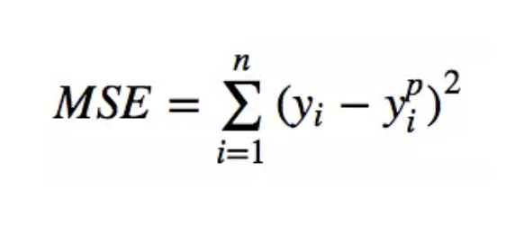
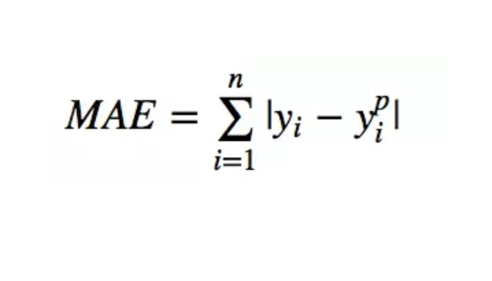
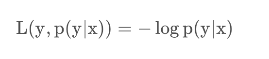
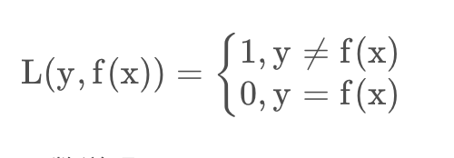
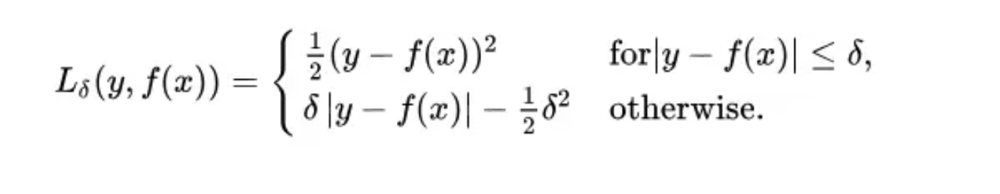
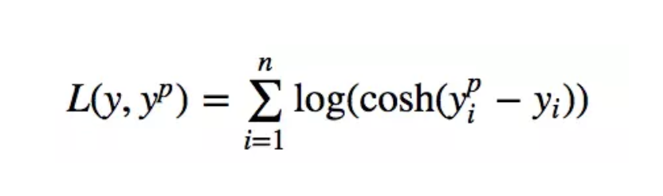

损失函数（loss function）是用来估量模型的预测值f(x)与真实值Y的不一致程度，它是一个非负实值函数,通常使用L(Y, f(x))来表示，损失函数越小，模型的鲁棒性就越好。 
## 损失函数、代价函数、目标函数
- 损失函数（Loss Function ）是定义在单个样本上的，算的是一个样本的误差。
- 代价函数（Cost Function ）是定义在整个训练集上的，是所有样本误差的平均，也就是损失函数的平均。
- 目标函数（Object Function）定义为：最终需要优化的函数。等于经验风险+结构风险（也就是代价函数 + 正则化项）

# 适用于回归任务的损失函数
## 均方误差（L2损失）
&ensp;&ensp;&ensp;&ensp;均方误差(MSE)是最常用的回归损失函数，计算方法是求预测值与真实值之间距离的平方和  

  

## 平均绝对值误差（L1损失）
&ensp;&ensp;&ensp;&ensp;平均绝对误差（MAE）是另一种用于回归模型的损失函数。MAE是目标值和预测值之差的绝对值之和  
 

## 对数损失函数（logarithmic loss function）
&ensp;&ensp;&ensp;&ensp; 对数损失函数用到了极大似然估计的思想，我们对p(y|x)通俗的解释就是：  
&ensp;&ensp;&ensp;&ensp;在当前模型的基础上，对于样本x它的预测值为y，也就是我们预测正确的概率，但是我们在概率之间的同时满足需要使用乘法，考虑到计算方便，我们取对数将其转化为加法，同时由于是损失函数，所以预测正确的概率越高，其损失值应该是越小，因此再加个负号取反。  
 

函数特点：
- log损失函数能够很好的表示概率分布，适用于很多的分类场景中，如果需要知道结果属于每个类别的置信度log损失函数非常适合。
- log损失函数对噪声很敏感。
-  逻辑回归的损失函数就是log损失函数。
# 适用于分类任务的损失函数
## 0-1损失函数（0-1 loss function）
&ensp;&ensp;&ensp;&ensp;关于0-1损失函数，也就是说当我们预测错误时，损失函数的值为1，预测正确时，损失函数的值为0，该函数无需考虑预测值和真实值的误差程度，只要预测错误就会输出1。
   
&ensp;&ensp;&ensp;&ensp;0-1损失函数直接对应分类判断错误的个数，但是它是一个非凸函数，不太适用  
# 其他损失函数
## Huber损失，平滑的平均绝对误差
&ensp;&ensp;&ensp;&ensp;Huber损失对数据中的异常点没有平方误差损失那么敏感。它在0也可微分。本质上，Huber损失是绝对误差，只是在误差很小时，就变为平方误差。误差降到多小时变为二次误差由超参数δ（delta）来控制。当Huber损失在[0-δ,0+δ]之间时，等价为MSE，而在[-∞,δ]和[δ,+∞]时为MAE。

    

&ensp;&ensp;&ensp;&ensp;这里超参数delta的选择非常重要，因为这决定了你对与异常点的定义。当残差大于delta，应当采用L1（对较大的异常值不那么敏感）来最小化，而残差小于超参数，则用L2来最小化

## Log-Cosh损失
&ensp;&ensp;&ensp;&ensp;Log-cosh是另一种应用于回归问题中的，且比L2更平滑的的损失函数。它的计算方式是预测误差的双曲余弦的对数。

  